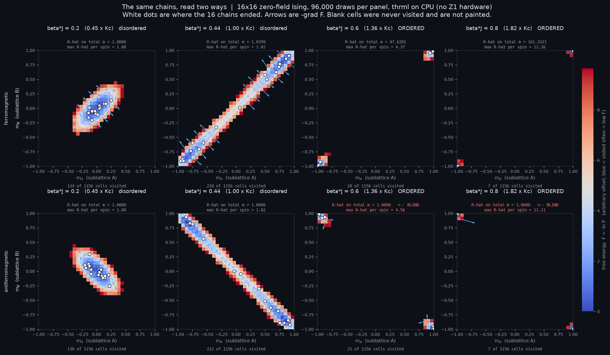
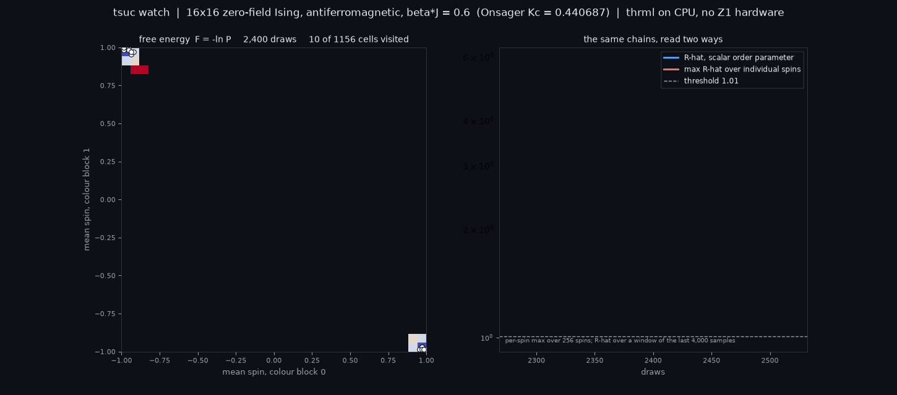

<h1 align='center'>tsu-compiler</h1>

<p align='center'>An Ising-model compiler for thermodynamic sampling hardware.</p>

A thermodynamic sampling unit (TSU) computes by drawing samples from a physical
energy landscape rather than by doing arithmetic. Before a problem can run on one,
two questions have to be answered: **will it fit the hardware**, and **at what
coupling should it be sampled**.

`tsu-compiler` answers both. It takes a constrained computational problem, compiles
it to an Ising model, checks it against a declarative hardware profile, and — when
it does not fit — says which constraint failed, by how much, and which
representation to try instead.

> **Scope, stated up front.** The first question — *will it fit* — is answered by
> the gates, and that part is real: measured limits against published figures,
> with provenance on every one. The second half of placement is not. This
> repository does **direct** embedding, one logical spin to one physical p-bit,
> which only works when the interaction graph is already lattice-shaped. It has
> no chain (minor) embedder, so for general graphs it reports that its search ran
> out rather than placing them. `audit/findings/R33.md` measures exactly why and
> what it would take to fix. Read this as a preflight and gate-checking tool that
> also places lattice-shaped workloads, not as a general placer.

> **This is an independent project.** TSUs are hardware built by Extropic.ai; the `z1`
> profile shipped here targets Extropic's *published* constraints. Nothing in this
> repository is affiliated with, endorsed by, or derived from any hardware vendor's
> proprietary source, and no program here has ever run on physical silicon.
>
> **It is also not Extropic's toolchain.** Extropic publishes its own path from
> program to hardware. This is a separate, host-side front end with a different
> input language and a different embedding primitive, and it does not claim to
> produce what their tools would produce. What it targets is a *Z1-shaped
> idealization*: the published degree, offsets, node budget and coupling cap,
> plus the assumptions `target.py` marks as assumed — chiefly that every edge
> carries its own independently programmable coupling. Extropic's own figures
> report 215,904 coupling parameters against 2,135,904 coupling edges, so on the
> physical die some couplings are evidently shared. Until that sharing rule is
> published, a compiled program here is a program for the idealization, not a
> die program. See `audit/findings/R2.md`.

Features include:

- Representation search (domain-wall vs one-hot), keeping rejected candidates as evidence
- Exact mediator insertion for graphs that are not 2-colourable, restoring the
  bipartiteness block Gibbs needs. This is a **colouring** fix, not a placement
  one: a mediator breaks an odd cycle, and it does not make a long-range logical
  edge realizable on a die that only couples nearby p-bits. Those are two
  different problems and this repository solves the first exactly and the second
  heuristically.
- Lattice embedding that is exact for grid-shaped graphs on the four axis-unit
  offsets, and a budgeted search for everything else. **The search is known to
  fail on graphs that are not already lattice-shaped, and that is structural
  rather than a budget problem** — see `audit/findings/R33.md`, which measures
  why. Exhaustion is reported as a search that ran out, never as hardware that
  cannot host the model.
- Hardware gates carrying per-limit provenance — documented figure vs project assumption
- Transition location by finite-size scaling, with τ, effective sample size and Gelman–Rubin
- Replayable receipts that report `unavailable` with a reason rather than a fabricated value

Compilation runs entirely on host CPU. The block-Gibbs sampling loop is executed by
[THRML](https://github.com/extropic-ai/thrml) on JAX, and `provenance.json` records
the backend so an artifact is never mistaken for a hardware measurement.

## Requirements

Python 3.11 or newer, with `thrml` and `extro-torx` available. The package
provides the `tsu-compiler` command and `tsuc` as a short alias.

## Quick example

Any Ising model, as an edge list:

```json
{"nodes": 4, "edges": [[0,1,0.5],[1,2,0.5],[2,3,0.5]],
 "biases": [0,0,0,0], "beta": 0.4}
```

```bash
tsuc preflight --edges model.json --out out/pf   # will it fit?
tsuc regime    --edges model.json --out out/rg   # where should it sample?
```

`preflight` reports every gate with its measured value, its limit, and whether
that limit is a documented hardware figure or an assumption:

```
| gate             | value  | limit  | % of limit | status | note                  |
| max_abs_coupling | 0.5    | 6      | 8.3%       | ok     | |J| against the ...  |
| max_abs_bias     | 9      | 6      | 150.0%     | fail   | ... (ASSUMED)         |
```

A verdict resting only on an assumed limit says so, and offers `--allow-assumed`.

## The pipeline

    encode → lower → analyse → gate → place → mediate → re-gate → program → verify

Mediation raises every coupling it touches — `A = acosh(exp(2β|J|)) / (2β) > |J|`
for all `J ≠ 0` — so gates are re-run afterwards, and `preflight` predicts the
result from the closed form before placement runs.

A compilation that hits an unexpected fault reports `COMPILER_ERROR`, never a
hardware verdict about the user's model.

## Working from a spec

```bash
tsuc inspect   specs/toy.yaml
tsuc compile   specs/toy.yaml --target z1 --out out/toy
tsuc report    out/toy
tsuc replay    out/toy
```

Workloads are spec files. No workload-specific code path exists in the compiler,
and a test enforces it.

## Target profiles

A hardware target is declarative — degree, offsets, caps, node budget, schedule —
and every field records whether its value is a documented figure or an assumption.
A `z1` profile and an `ideal` control ship today.

The gate and mediation layers are profile-driven and have been tested working
against a non-Z1 target. The lattice placer assumes a fixed-offset topology and
would need replacing for a different one.

## Receipts

`audit/` holds the findings, the oracles, and the measurements. Every figure names
the script that produced it or is labelled unreproduced at the point of use.

`audit/oracles/exact.py` enumerates the Boltzmann distribution independently and
does not import `src/tsu_compiler`, so it cannot inherit a sign convention or an encoding
bug from the code it checks — asserted by a test on every run.

`out/extropic-verify/` runs published `codon_opt` models through the gates,
including a 3,147-spin instance at 9,557 edges and degree 12. Every gate passes
there — degree 12 of 16, |J| 2.5 of 6, |b| 4.05 of 6, 3,147 of 269,568 nodes —
and **it has not been placed**: the summary records `"place": null`, and a
preflight at the default budget of 6 restarts and 40,000 iterations reports
`effort`, not `ok`.

That is a search result and not a hardware verdict, and the distinction is the
whole point. Every gate passing means nothing in Z1's published limits refuses
this model. Not placing means this repository's budgeted greedy placer did not
find a coordinate assignment in the time it was given. Those are different
claims, and only the first is about the hardware. Note also that Extropic's own
approach uses a different embedding primitive, so a model this placer cannot
handle is not thereby a model Z1 cannot host.

`out/connectivity-cost/` measures what a bipartite lattice costs: 1.60× in
mediator spins on that model, against a bipartite control at 1.00×.

## What a diagnostic can miss



Free energy `F = -ln P` estimated from the sampler's own draws on a 16×16
zero-field Ising lattice, 96,000 draws per panel. Onsager gives the exact
critical point, `Kc = 0.440687`, so "ordered" is known in advance rather than
read off the picture. White dots are where the 16 chains ended, arrows are
`-grad F`, and **blank cells were never visited** — `F = -ln 0` is infinite, and
painting those would invent landscape the sampler never entered.

The axes are the two chessboard sublattices. A ferromagnet orders with them in
agreement, so its basins sit on the diagonal; an antiferromagnet orders with
them opposed, so its basins sit on the *anti*-diagonal — where the total
magnetisation `(m_A + m_B)/2` is **zero for both**.

That is the whole point. In the bottom-right panel the chains are frozen in two
different configurations, and a scalar order parameter collapses both onto the
same number and reports `R-hat = 1.0000`. The per-spin diagnostic, on the same
draws, reports 11.11. The cell counts show what is actually happening: the
chains visit 7 of 1,156 cells and never cross between them.

This is why the sampling verdict in this project rests on every spin
individually rather than on their average. The diagnostic that establishes it,
including the case where a scalar statistic reports convergence on chains that
never mix, is in `audit/diagnostic_control.py`.
Regenerate with `python audit/free_energy_sublattice.py`.

### Watching it happen

```bash
tsuc watch --lattice 16 --sign antiferro --beta 0.60
```



`tsuc watch` samples a model live and puts the free energy surface next to both
readings of the same chains. The left panel accumulates; the right panel is the
two diagnostics over draws. The scalar stays flat on 1.0 while the per-spin
maximum settles around 5 — and the surface shows why: the chains split between
two basins, visit 23 of 1,156 cells, and never cross.

It works on any model (`--spec`, `--edges`) as well as the built-in lattice. The
coordinates are the compiler's own two colour blocks, which is what makes block
Gibbs apply in the first place; on a square lattice they are the chessboard
sublattices. A non-bipartite model is mediated first and the title says so.

Chains genuinely continue across updates (`stream_chains`, verified against the
exact oracle and against an independent-restart baseline in
`tests/test_stream_chains.py`). Updates cap at roughly **2.5 per second** —
wall time is dominated by per-call dispatch into thrml rather than by sampling,
so 400 samples per update cost about 30% more than 40. It is a live instrument,
not a 30fps animation.

## How this was built

Written with heavy AI assistance, stated here so no reviewer has to infer it
from the commit trailers.

The direction is mine: which problem to attack, which target to model, what
counts as evidence, and which results to retract. The implementation, the tests
and much of the prose were written with Claude (Opus 5), and the commits carry
`Co-Authored-By` trailers throughout. Grok has audited specific claims and found
real ones — the README's feature list previously conflated the mediator gadget
with topology placement, and that came out of an outside review, not from me.

The method is also part of the work rather than incidental to it. This was built
through **agent development**: standing up autonomous and semi-autonomous agents,
scoping them, giving them the tools and the refusal rules, and running them
against the problem — including adversarial review agents whose job is to attack
the claims in this repository. `audit/findings/` is largely the output of that
loop, retractions included.

The clearest external evidence that it produces real results is not in this
repository at all. An agent of mine reported a `uint8` truncation bug in THRML's
`CategoricalNode` upstream ([extropic-ai/thrml#62][thrml62], 2026-07-05), and
Extropic closed it four days later. That is a real defect, in someone else's
shipped library, found and reported by an agent built for this work.

[thrml62]: https://github.com/extropic-ai/thrml/issues/62

Two things are worth knowing about what that does and does not mean.

It does not mean the repository was generated. `git log` is the record: work
began 2026-08-26 and the GitHub repo was published 2026-09-14, by which point
248 of the commits already existed, at a steady 60-97 per week. Nothing here was
produced in a sitting.

It does mean the verification matters more than usual, which is why the
structure is what it is. The Boltzmann oracle in `audit/oracles/` does not
import the compiler, and a test asserts it never starts to. Sampled moments are
checked against brute-force enumeration to five standard errors, a bound that
fails a systematically wrong distribution no matter how many samples are drawn.
Hardware limits carry `Sourced` or `Assumed` per field. `audit/findings/`
records the retractions alongside the results, including the ones where a
measurement contradicted my own stated reasoning and the reasoning lost.

None of that is a substitute for someone else running it. There is no external
validation of this work, no users, and nothing here has touched silicon.

## License

Apache-2.0. See `LICENSE` and `NOTICE`.
